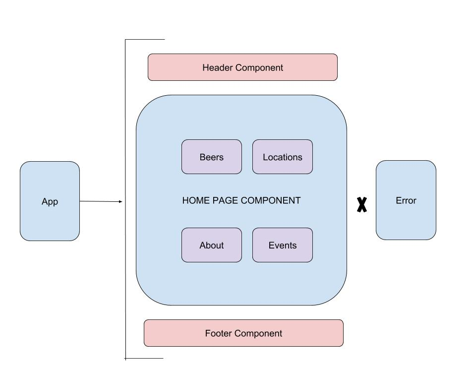

# _Brewery Site Using React_

#### _Dividing, Re-creating, and Re-building Breakside Brewery's Site as a model using React, 04/26/19_

#### By _**Nelia Terrazas**_

## Description/Component Structure

This is the structure I will use to continue to develop my site. This chart displays component structure for the main homepage.

## Roadmap

This site is still very static. My next goals are to replace location and events screenshots with functioning buttons and links to display more content. I am working on adding an admin path to update the current tap list. 

## Setup/Installation Requirements

* Clone this repository at https://github.com/neliaterrazas/react-template.git onto your desktop
* Run npm i to install dependancies
* $ npm run start so display on your local browser

## Known Bugs

Width: 100% is not working as expected.

## Support and contact details

_Please contact Nelia Terrazas at terrazasnelia@gmail.com_

## Technologies Used

* React
* CSS
* HTML
* Git / GitBash

### License

*MIT*

Copyright (c) 2019 **_Nelia Terrazas_**
